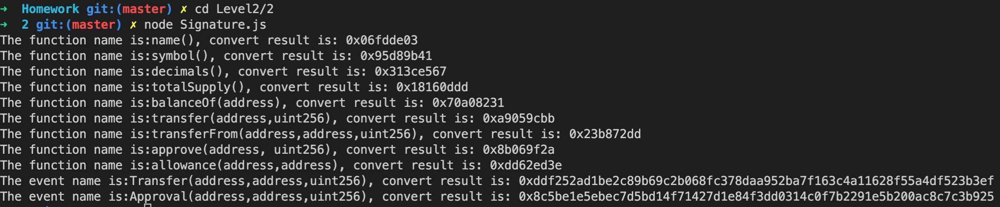

# Homework

### Level 2
- [通过rpc拿到pancake所有pair address](https://github.com/HanWang233/Homework/tree/master/Level2/0)

- [通过rpc向venus提供流动性，取出流动性](https://github.com/HanWang233/Homework/tree/master/Level2/1)
  
- [阅读ERC20, ERC721, ERC1155标准，并将标准内function和event转换成signature](https://github.com/HanWang233/Homework/tree/master/Level2/2)
  
